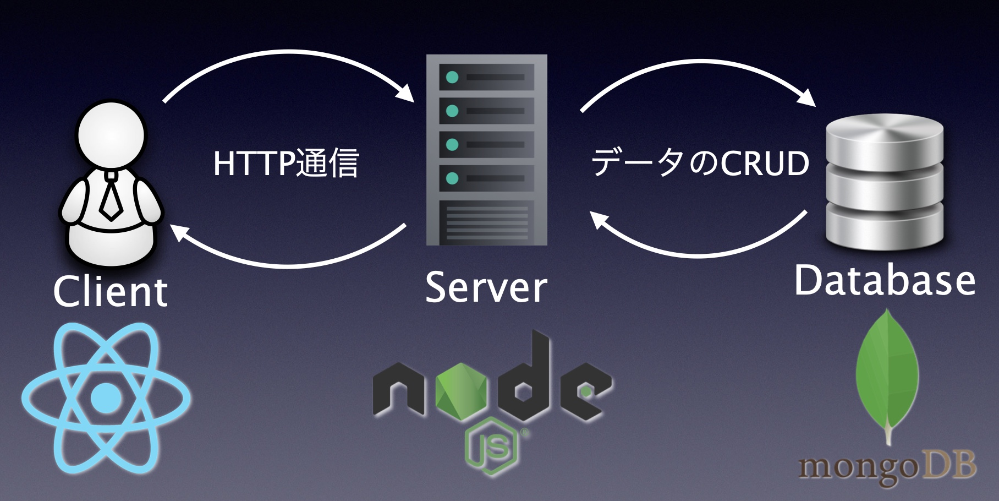

# ESONIC


## What is ESONIC?

英後学習(English)を素早く行う(SONICally)ためのアプリケーション

## Getting Started (Installation)

ESONIC のコードを見る場合や自身の環境で利用する場合は以下のコマンドを入力してください。
コマンドを打ち込み終わったら localhost:5173 とブラウザに打ち込めば OK です。

Note : NodeJs と npm が必要です。

```
git@github.com:TlexCypher/ESONIC.git

cd ESONIC/frontend

npm install # 必要なパッケージをpackage.jsonを読んでインストール

npm run dev # フロントエンドサーバーのスタート

cd ../backend

npm install # 必要なパッケージをpackage.jsonを読んでインストール

npm run dev # バックエンドサーバーのスタート
```

ドメインも取得済みなので利用したい人は Usage Example をご覧になった後で URL から利用してください。

## Usage Examples (Demo)

- サインイン

https://github.com/TlexCypher/ESONIC/assets/144787772/3df580df-45ad-4581-a4c3-646ed0b8e8a3

- サインアップ

https://github.com/TlexCypher/ESONIC/assets/144787772/f6b7c720-d28a-408c-ac93-0ea1b49f3bfa

- 新規ワード追加機能


https://github.com/TlexCypher/ESONIC/assets/144787772/f203f01b-274b-4238-8b3e-8fce0c5eda8b


- 自分用のテスト作成機能


https://github.com/TlexCypher/ESONIC/assets/144787772/daa477c6-a67a-4ee7-9c7e-c00d978f77a3


## Description

このアプリケーションは、覚えたい英単語を追加することで、自分専用のテスト問題集を作成してくれる Web アプリケーションです。

URL にアクセスしたユーザは、アカウントを作成したらすぐに英単語学習を始めることができます。

このアプリケーションは、下記のような状況を想定して作成しました。

- 自分だけの英単語帳を作って反復学習を行うことで素早く英単語を覚えられる。

### Why I made this app?

私がこのアプリケーションを作成した経緯としては、自身の英単語学習を Hack したいと思ったからです。

私の従来の英単語勉強方法は、単語帳を購入し、外出時もその単語帳を持ち歩いて何度も反復を行うことで暗記するというものでした。

しかし、一度覚えたと思った単語でも数週間後には忘れてしまいますし、暗記するのに苦労した単語が一体どれだったのかを自分で全て管理することに難しさを感じていました。

これを解決するために過去に間違えた単語を永久的に保存し、自分専用のテストを作成してくれるアプリケーションを開発することを思いつき、ESONIC を作成しました。

また技術的な経緯としては、JWT による認証機能と Node.JS を使ったバックエンド API のアウトプットを行うために作成しました。

## Functionalities

ユーザのサインアップ等の認証機能、英単語と日本語の意味のセットを追加する機能、追加した単語の中からランダムにテストを作成してくれる機能があります。

## System Design

本アプリケーションの設計は以下です。  
基本的なサーバクライアントモデルを使用しています。


